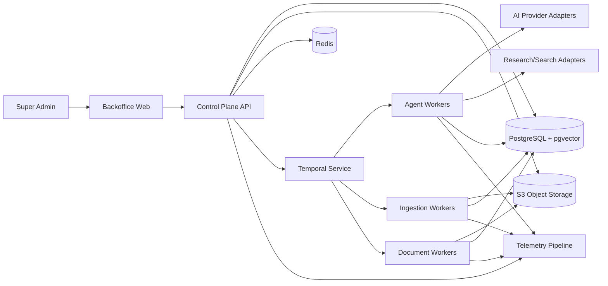

# معماری کلان سامانه Docoo

## ۱. سبک معماری

نسخهٔ اول به‌صورت **modular monolith با workerهای مستقل** ساخته می‌شود. API/control plane یک deployable منطقی است، اما ماژول‌های دامنه boundary و dependency rule سخت دارند. کارهای طولانی در workerها و workflow engine اجرا می‌شوند. این انتخاب از توزیع زودهنگام transaction و عملیات جلوگیری می‌کند و هم‌زمان مسیر استخراج سرویس‌های پرمصرف را باز می‌گذارد.

## ۲. تکنولوژی پیشنهادی

- زبان اصلی: TypeScript با strict mode.
- monorepo: pnpm workspace + task runner.
- Backoffice: React/Next.js با i18n و SSR محدود به صفحات مناسب.
- API: NestJS یا Fastify-based application با OpenAPI؛ انتخاب نهایی در spike.
- Workflow: Temporal self-hosted برای durable execution، signal و retry.
- Database: PostgreSQL با RLS و pgvector.
- Cache/rate limit: Redis؛ منبع حقیقت نیست.
- Object storage: S3-compatible؛ MinIO در توسعه.
- Document rendering: service worker با DOCX/PPTX libraries و Chromium/HTML-to-PDF؛ LibreOffice فقط مسیر fallback کنترل‌شده.
- Extraction: Apache Tika یا parserهای sandbox، OCR و transcription adapter.
- Observability: OpenTelemetry، Prometheus-compatible metrics، log backend و trace backend.

Temporal برای workflowهایی مناسب است که باید پس از crash و outage از همان نقطه ادامه یابند؛ این دقیقاً با pause/human gate و اجرای چندمرحله‌ای Docoo هم‌راستاست. مرجع: https://docs.temporal.io/

PostgreSQL RLS پس از فعال‌شدن، دسترسی row را بر اساس policy محدود و در نبود policy رفتار default-deny دارد؛ این کنترل دفاع دوم tenant است، نه جایگزین authorization برنامه. مرجع: https://www.postgresql.org/docs/17/ddl-rowsecurity.html

## ۳. نمای کانتینر



## ۴. ماژول‌های control plane

- IdentityAccess
- Workspaces
- Topics
- Projects
- Configuration
- AgentCatalog
- WorkflowFacade
- KnowledgeGovernance
- Solutions
- Documents
- Providers
- Audit
- Reporting

هیچ ماژول نباید جدول private ماژول دیگر را مستقیم write کند. queryهای cross-module از read model یا application service عبور می‌کنند.

## ۵. workerها

### Agent Worker

Context build، provider invocation، tool loop، validation و handoff. Worker stateless است و state قطعی در Temporal/PostgreSQL/object storage قرار دارد.

### Ingestion Worker

scan، MIME detect، extraction، OCR، transcription، chunking، claim candidate و index.

### Document Worker

structured document validation، chart rendering، DOCX/PDF/PPTX generation، checksum و artifact publish.

### Maintenance Worker

expiry/re-audit، purge، retention، catalog refresh، health check، cost reconciliation و orphan cleanup.

## ۶. مسیر درخواست

Commandهای سریع در API validate و transaction می‌شوند و workflow/job شروع می‌کنند. API پاسخ `202 Accepted` با operation ID می‌دهد. UI از SSE/WebSocket یا polling bounded برای status استفاده می‌کند. queryها از read model و pagination استفاده می‌کنند.

## ۷. ارتباط و event

- داخل process: application event typed.
- پس از transaction: transactional outbox.
- workflow signal: Temporal signal/update.
- UI update: domain notification channel بدون محتوای حساس.
- external webhook: خارج نسخهٔ اول، اما event schema آماده است.

## ۸. deployment topology

### توسعه

Docker Compose: web، api، workerها، postgres، temporal، redis، minio و telemetry حداقلی.

### production تک‌سرور

reverse proxy/TLS، imageهای immutable، volume/managed disk جدا، backup خارج سرور و secrets injection.

### scale-out

API replica، worker pool جدا per task queue، managed یا HA PostgreSQL/Temporal، object storage بیرونی و Redis HA. استخراج service از monolith فقط با evidence load/team boundary.

Docker Compose می‌تواند تعریف پایه را بین توسعه و production تک‌سرور حمل کند، اما production override باید bind mount کد را حذف، restart policy و config/secret مناسب اعمال کند. مرجع: https://docs.docker.com/compose/how-tos/production/

## ۹. dependency rule

```text
UI -> API Contract -> Application -> Domain
Infrastructure -> Application ports
Domain -> هیچ framework/provider
```

Temporal workflow code orchestration را می‌شناسد اما business invariant در domain service است. SDK provider فقط در infrastructure adapter.

## ۱۰. تصمیم‌های scale

- ۲۵ اجرای هم‌زمان baseline، per-provider semaphore.
- task queue جدا برای agent، ingest، OCR/audio و render.
- فایل بزرگ هرگز از API memory عبور نمی‌کند؛ presigned upload.
- embedding async و index versioned.
- audit write path سبک و append-only.

## ۱۱. failure domains

- provider outage: workflow pause، control plane سالم.
- renderer outage: سند source حفظ، export retry.
- search outage: تحقیق fail/paused، پروژه‌های دیگر مستقل.
- Temporal outage: command جدید متوقف، state PostgreSQL/Temporal durable.
- object storage outage: ingest/export متوقف، metadata حفظ.
- telemetry outage: application نباید fail شود؛ bounded buffer و alert.
